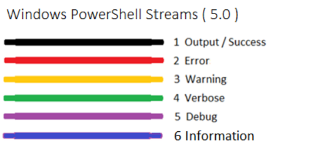

# PowerShell cheat sheet

This is a PowerShell version 5 cheat sheet to make the daily usage a little bit easier without googling and gathering the information from multiple sources.

## Table of contents
blablabla


## Output streams

PowerShell knows the following output streams:



[Source: Microsoft DevBlogs](https://devblogs.microsoft.com/scripting/weekend-scripter-welcome-to-the-powershell-information-stream/)


Writing to the different streams is done with:

```PowerShell
Write-Output
Write-Error
Write-Warning
Write-Verbose
Write-Debug
Write-Information, Write-Host
```
